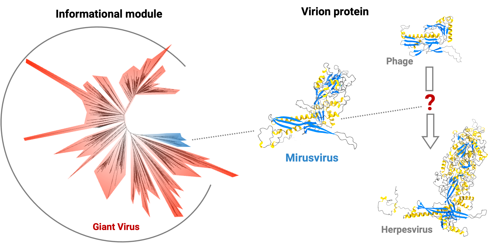

#### Thank you for being here!

### Introduction

  

  
I am currently working at [the Ogata Lab](https://cls.kuicr.kyoto-u.ac.jp/en/) of [Kyoto University](https://www.kyoto-u.ac.jp/en) as an assistant professor.  
I aim to understand the role of giant viruses (i.e., the viral phyla "[Nucleocytoviricota](https://www.google.com/url?sa=t&rct=j&q=&esrc=s&source=web&cd=&ved=2ahUKEwj0k5Ogr-GEAxX_m68BHaCUCLgQFnoECDUQAQ&url=https%3A%2F%2Fen.wikipedia.org%2Fwiki%2FNucleocytoviricota&usg=AOvVaw0gbPsn6g-N0t75RIj8bkkl&opi=89978449L)" and "[Mirusviricota](https://www.nature.com/articles/s41586-023-05962-4)") in the global marine ecosystem and to find evidence of how these viruses influence the evolution of their eukaryotic hosts.  
Benefiting from the development of various sequencing methods, I can see the light getting brighter in the dark room. And I am fortunate to be in a position to work on a database for [KEGG](https://www.kegg.jp), where I am surrounded by "unknowns".

### Disciplines
Marine Biology, Microbiology, Bioinformatics, Aquaculture  

### Skills and expertise  
Ecological Roles of Viruses and Host Regulation Mechanisms  
Comparative Genomics Analysis and Viral Evolution  
Functional and Pathogenic Microorganisms in Aquatic Environments  
Viral Protein Functions

### Languages
Chinese  
English  
Japanese  

### Contact information
lingjie@kuicr.kyoto-u.ac.jp
[Google scholar](https://scholar.google.com/citations?user=AuAm9f0AAAAJ&hl=en)
[ResearchGate](https://www.researchgate.net/profile/Lingjie-Meng-2)

### Github Activity

<!--
**LingjieEcoEvo/LingjieEcoEvo** is a ✨ _special_ ✨ repository because its `README.md` (this file) appears on your GitHub profile.

Here are some ideas to get you started:

- 🔭 I’m currently working on ...
- 🌱 I’m currently learning ...
- 👯 I’m looking to collaborate on ...
- 🤔 I’m looking for help with ...
- 💬 Ask me about ...
- 📫 How to reach me: ...
- 😄 Pronouns: ...
- ⚡ Fun fact: ...
-->
